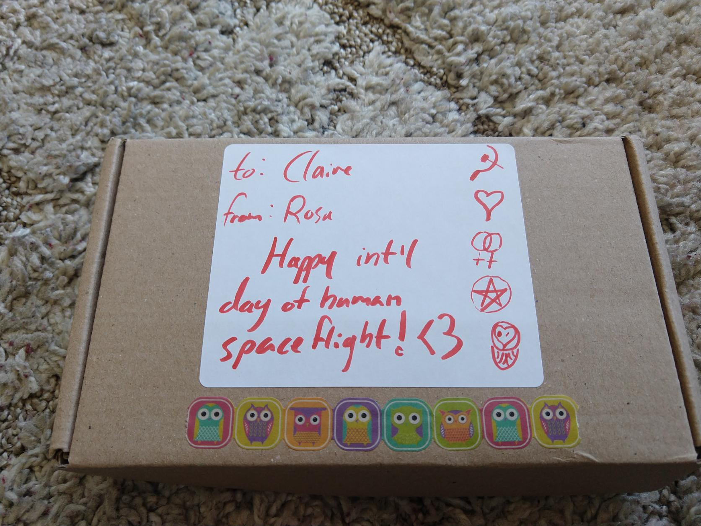
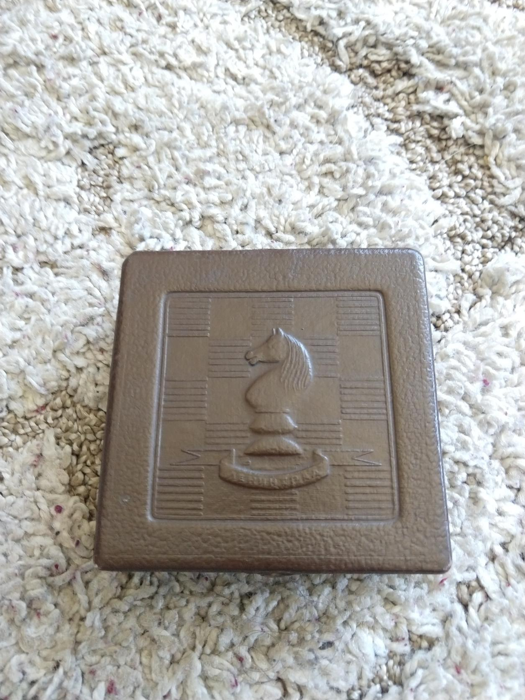
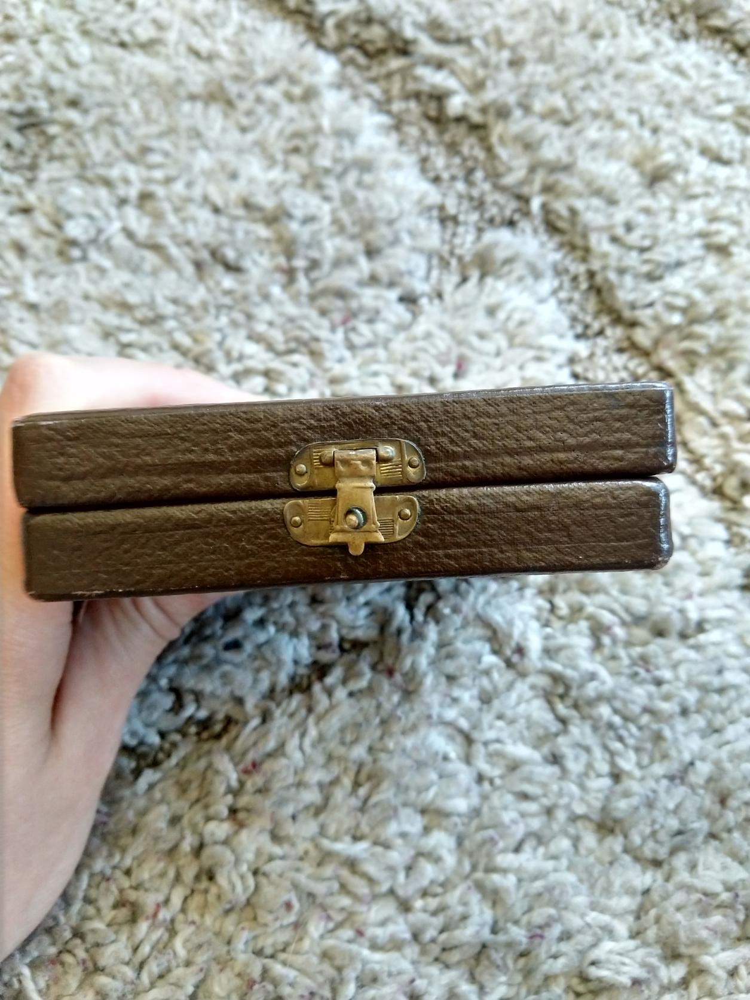
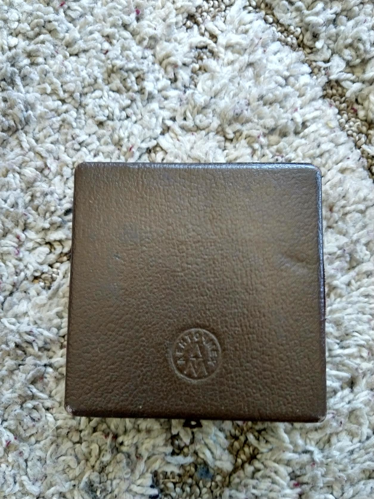
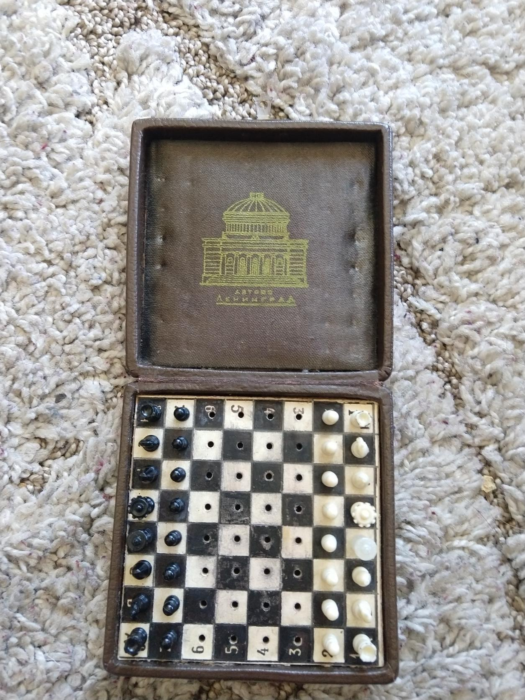
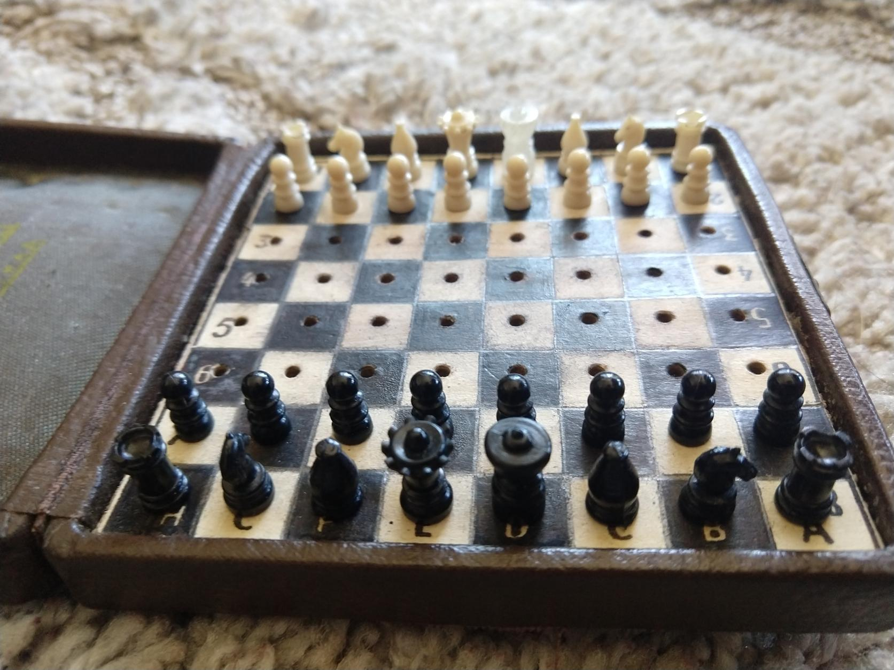

# a soviet-era travel chess set

april 12 was international day of human spaceflight (the day that hero of the soviet union yuri gagarin became the first person to venture beyond the atmosphere). 

i love the soviet union, old soviet stuff, chess, and trains, and rosa, a partner of mine, knows this, so she surprised me with a small gift for int'l day of human spaceflight.

this travel chess set was made in the ussr. it is designed so that you can close the lid while a game is in progress and as long as the lid stays shut, the pieces stay in the places they were left in. it comemmorates the Avtovo Leningrad metro station, widely considered to be one of the most beautiful subway stations in the world. the pieces follow the soviet conventions of not including any religious iconography.

i adore this little chess set and am very excited about it! next time i'm on a train i want to put it to use :3 

{:style="max-width: 300px;"}

{:style="max-width: 300px;"}

{:style="max-width: 300px;"}

{:style="max-width: 300px;"}

{:style="max-width: 300px;"}

{:style="max-width: 300px;"}
