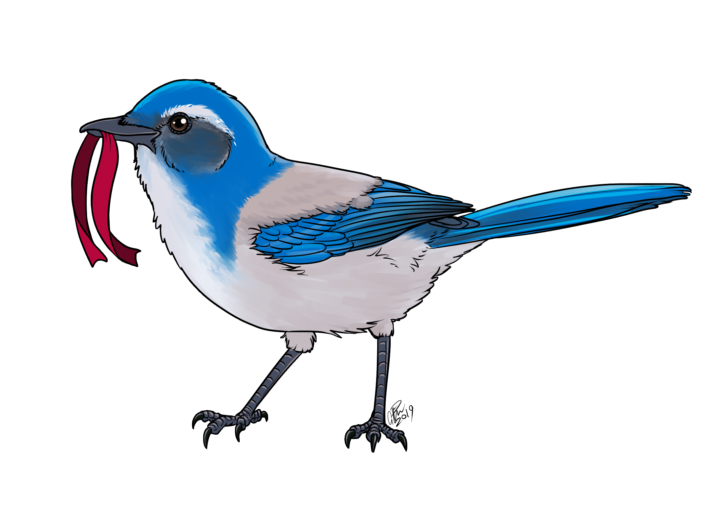

# spiders & birds

{:style="max-width: 300px; float: right;"}

welcome to the internet home of colleen lenin quine ([she/her or they/them](http://pronoun.is/she/:or/they)), a autistic communist trans dyke. scrub jay art by [g pike](http://artofgpike.com)

## music

check out my music on my [bandcamp](https://spiders.bandcamp.com). i also made a [cheat sheet](./files/solfège-chart.pdf) for learning chromatic solfège and musical intervals. happen to adore the song "A Rebuilding Year" by Griffin McElroy from TAZ: Balance? lucky for you, i've transcribed it as sheet music AND tablature [here!](./files/a-rebuilding-year.pdf)

## wildlife photography

i like to take pictures of spiders and bugs! you can see my latest observations [here](./spider-pics.md)

## stickers

i designed a sticker! it says "party girl ☭" on it and you can get one for free at [stickers.wob.app](https://stickers.wob.app)

## recipies

i enjoy cooking quite a bit. if you are interested in seeing what kind of stuff i make, step right in to the [witchin' kitchen](./recipes.md). everything is vegetarian!

## blog posts

sometimes i make blog posts! heres ALL of them

- [{{post.title}}]({{post.url}}) - {{post.date | date: "%Y-%m-%d"}}


## thanks

thank you so much to my partner iliana ([linuxwit.ch](https://linuxwit.ch)) for helping me with the css on this website!! 💛💛💛 & thank you so much to viewers like you
