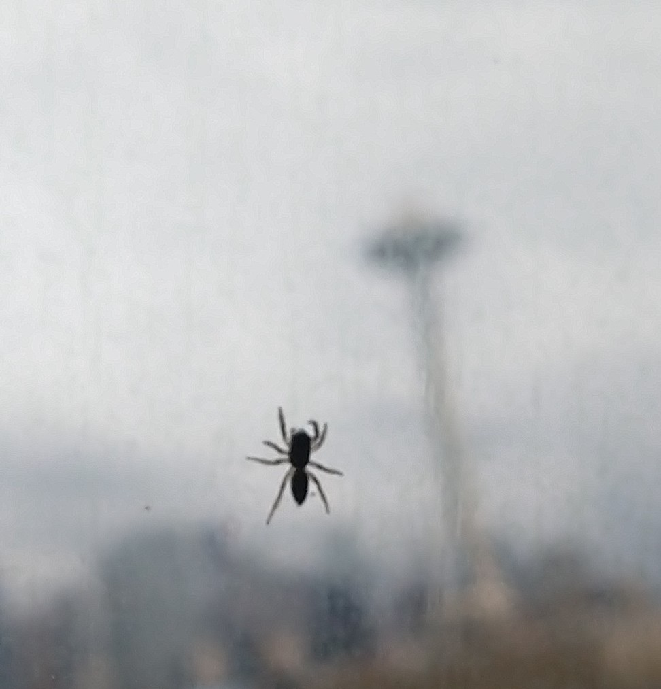
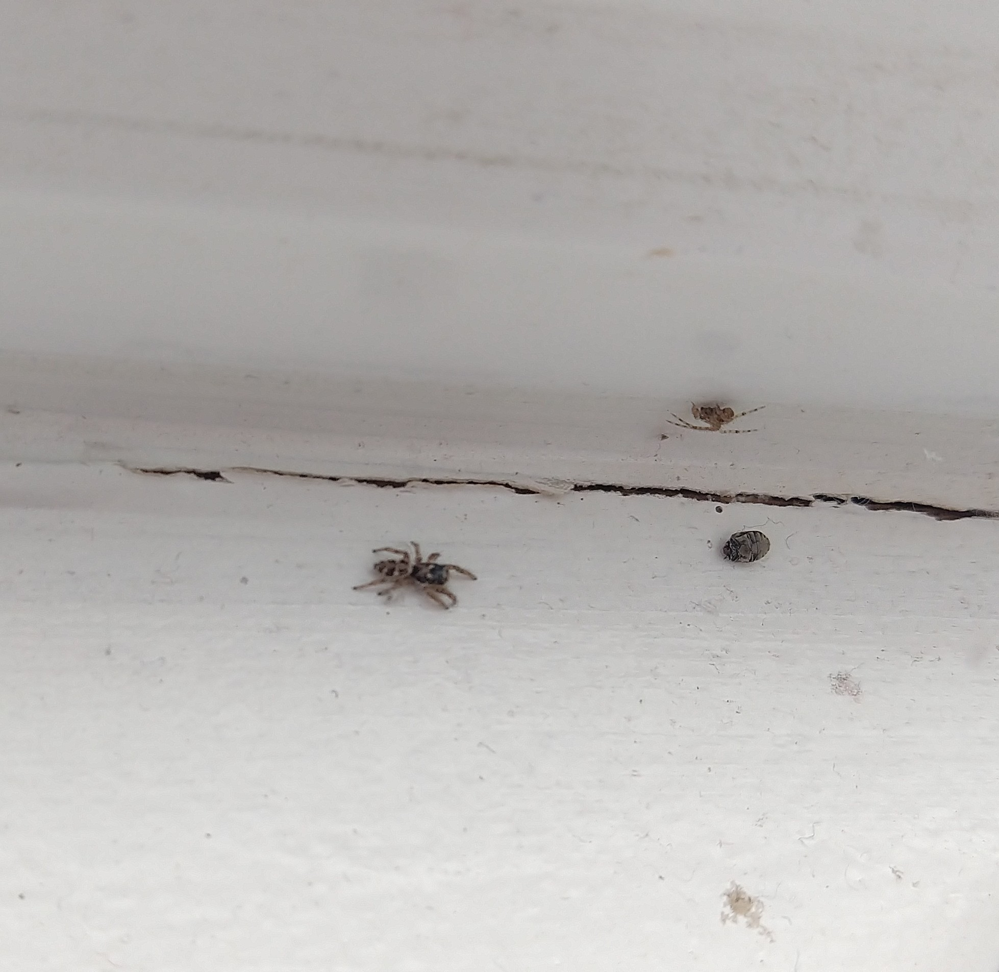
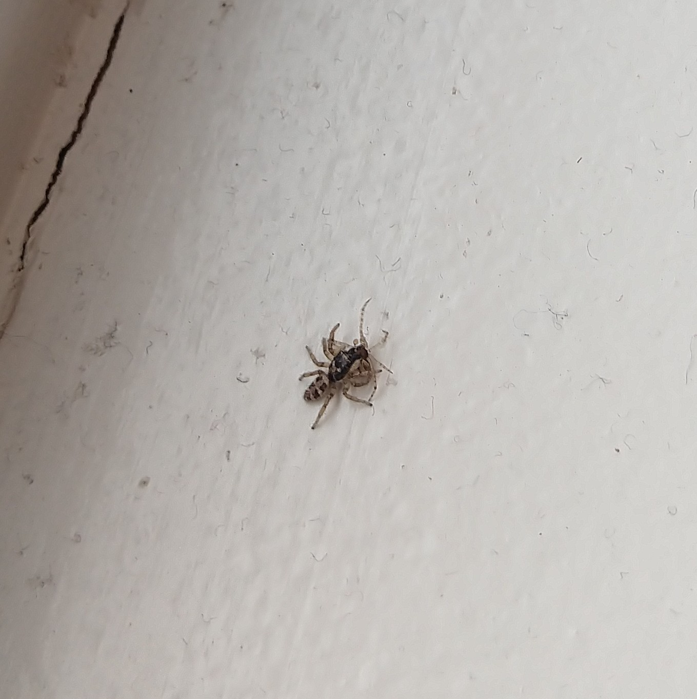
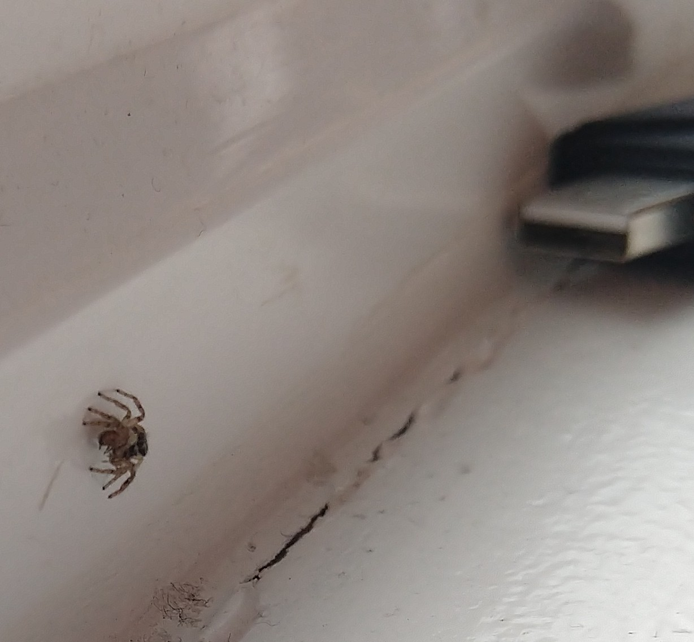
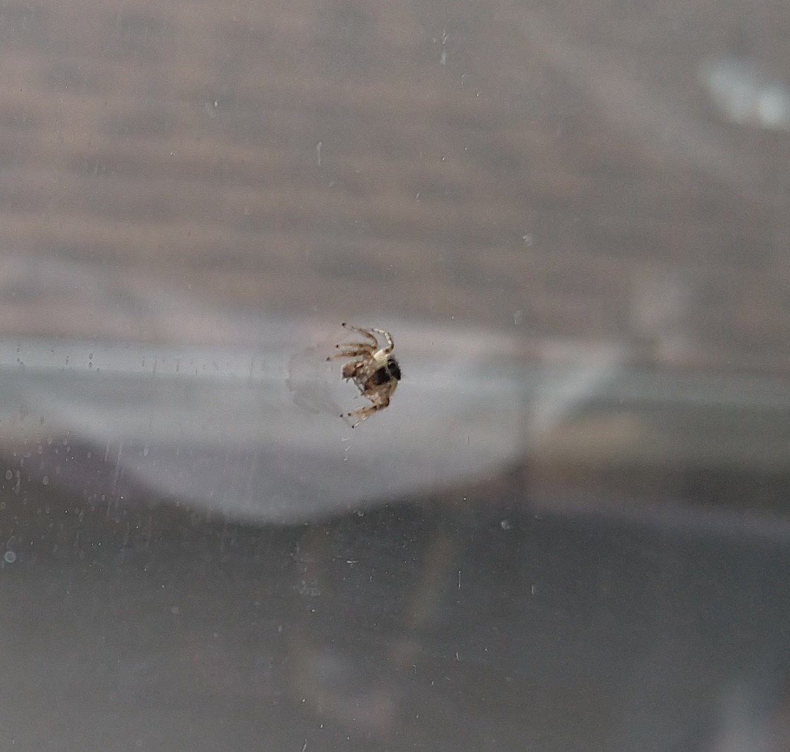

# spider pics

[< home](./index.md)

---

sighted 2019-04-08; family is *salticidae*, likely species is *salticus scenicus* (the zebra spider).

i first sighted our friend on the window of the kitchen.

{:style="max-width: 300px;"}

as dramatic as they looked against the window, i wanted a better photo of them, so i took one after they'd gone down to the sill. i didn't notice the second spider in the picture until i looked at the picture to see how it turned out. it's some kind of small house spider; possibly *parasteatoda tepidariorum*, although it's hard to say. also notice the dead coleopteran (beetle), likely a victim of the house spider.

{:style="max-width: 300px;"}

immediately after noticing the second spider, i sat and watched the jumping spider to see if they were trying to prey on the house spider. sure enough, they pounced, but missed. i felt bad for them because i'd been pestering them with my camera, so, i caught the fleeing house spider by their silk and dangled it near the jumping spider to give them a second chance. they went for it! in this picture, i caught the moment of them locked in a dramatic struggle with the doomed house spider.

{:style="max-width: 300px;"}

our spider hero emerges victorious! here's a couple of pictures of them enjoying their well-deserved meal.

{:style="max-width: 300px;"}

{:style="max-width: 300px;"}

---

sighted 2019-04-01 in a bedroom in seattle. family unknown.

{:style="max-width: 300px;"}
